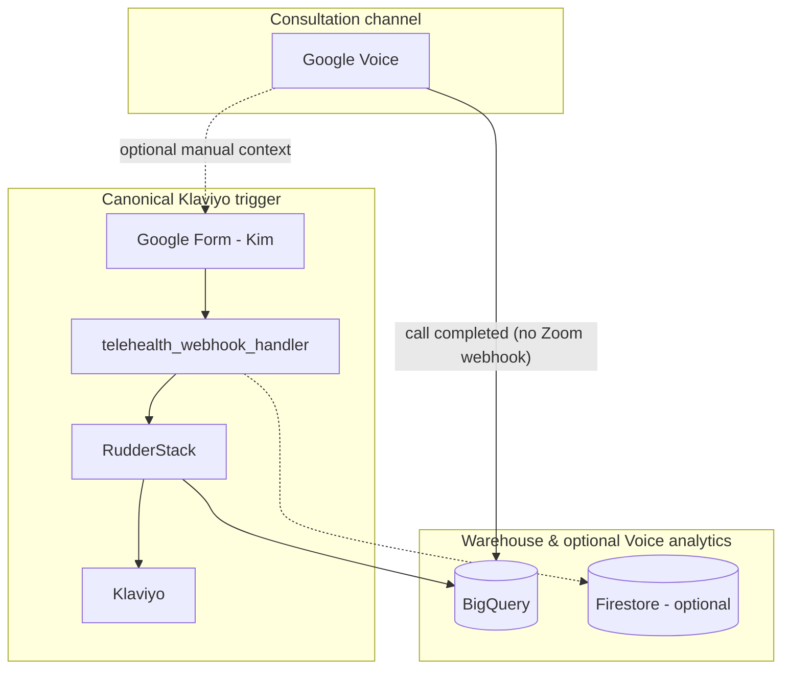

# Google Voice plans and replacing Zoom

**Audience:** Data engineering, GCP architecture, and anyone deciding whether Voice can replace Zoom as the **consultation channel** while keeping the **warehouse-first** telehealth stack.

**Sources:** Feature and pricing summaries below reflect [Google Voice for Google Workspace](https://workspace.google.com/products/voice/) as of the last review date. Confirm current SKUs, country availability, and contract terms with Google or your reseller before procurement.

---

## 1. Product boundary: Voice is not Zoom

| Dimension | Zoom (today) | Google Voice |
|-----------|--------------|--------------|
| Primary mode | Video + audio meetings | **Business telephony** (voice, SMS in supported regions) |
| Typical telehealth UX | Scheduled link, screen share | **Phone number** (and optional desk phones / SIP) |
| Rich automation hooks | Webhooks (`meeting.ended`, recordings, transcripts API) | **No direct equivalent** to Zoom’s meeting webhooks in the consumer mental model; **Premier** advertises **BigQuery** export for Voice activity reporting |
| Video | Native | **Not** a video product—use **Google Meet** (or another tool) if video is required |

**Implication:** “Replace Zoom with Voice” usually means **audio-first consults** (or **Voice + Meet**), not a one-for-one feature swap.

---

## 2. Workspace Voice plans (summary)

USD list pricing and bullets are as described on Google’s marketing page; asterisks on that page apply to calling/SMS terms.

| Plan | Indicative price (USD) | Scale / notes | Recording | Warehouse-relevant |
|------|-------------------------|---------------|-----------|---------------------|
| **Starter** | ~$10 / user / month | **Voice only:** one user; **Workspace add-on:** up to **10** users | Voicemail transcription; **easy call recording** (marketing copy) | No **BigQuery** Voice export called out |
| **Standard** | ~$20 / user / month | Unlimited users; regional billing locations; ring groups, auto attendants | **On-demand** call recording | **SIP Link**, eDiscovery; still no **BigQuery** export on the comparison grid |
| **Premier** | ~$30 / user / month | Unlimited international billing locations | **Automatic** call recording | **Advanced reporting of Voice activity with BigQuery** (explicit differentiator) |

**Principal recommendation for this repo’s architecture:**

- **Premier** if you need **native BigQuery** surface area for Voice activity and **automatic** recording to support analytics, compliance workflows, or future automation—aligned with a **warehouse-first** posture.
- **Standard** if **cost** dominates and **on-demand** recording plus admin features are enough, with analytics driven mainly by **Kim’s Google Form** and other sources.
- **Starter** only for **very small** teams and when you **do not** need Standard/Premier routing or BigQuery-native Voice reporting.

---

## 3. How this project uses Zoom today (context)

In production design (see `CLAUDE.md` and `TELEHEALTH_WORKFLOW_PLAN.md`):

- **Klaviyo triggers** for completed / no-show **patient emails** are driven by the **Google Form** path (`userId` = normalized **email**), not by sending duplicate `track` events from Zoom with a different identity key.
- **`meeting.ended`** may **store context in Firestore** (e.g. for optional merge when Kim supplies a meeting ID); it must **not** become a second, conflicting Klaviyo trigger.
- **Zoom** still matters for **transcript download**, **duration**, and **optional** enrichment—unless you replace that channel entirely.

Replacing Zoom with Voice **removes** that webhook/transcript stack unless you **rebuild** equivalents (e.g. recording + STT pipeline, or form-only operations).

---

## 4. Target architecture: Voice + form (warehouse-first)

Keep the **canonical** marketing/patient-event path stable: **identify(email) → track** from the **form** Cloud Function so Klaviyo does not fragment profiles.

### 4.1 Data flow roles

| Flow | Role | Idempotency / identity note |
|------|------|------------------------------|
| **Form → GCF → RudderStack → Klaviyo** | **Primary** patient follow-up events | Always **`userId` = normalized email**; **identify** before **track** (see existing `main.py` patterns). |
| **Voice → BigQuery** (Premier) | **Operational / analytics** CDR-style reporting | Join to patients via **phone number**, **time window**, or **manual** keys—**not** a second Klaviyo `userId` unless explicitly designed and deduped. |
| **Voice recordings + Vault** | Retention / eDiscovery (org policy) | Not automatically `kims_custom_note`; **Gemini/transcript** would be a **separate** pipeline with consent and compliance sign-off. |
| **Calendly** | Booking | Update **location** copy (dial-in / Meet) if Zoom links are retired. |

### 4.2 Optional: derived events from BigQuery

If product later wants **RudderStack** events from Voice data:

- Prefer **scheduled** jobs (Cloud Scheduler + BigQuery query + Cloud Function) that emit **at-most-once** or **deduped** events using a natural key (e.g. `voice_call_id`).
- **Never** introduce a second Klaviyo identity key for the same person (avoid repeating the `meeting_uuid` vs. email mistake).

---

## 5. What you gain vs. lose vs. Zoom

| Aspect | With Zoom (current) | With Voice (typical) |
|--------|---------------------|----------------------|
| Video | Yes | No (unless Meet or other) |
| **meeting.ended** webhook | Yes | **No** equivalent surfaced like Zoom |
| Transcript **.vtt** for Gemini | Yes (with recording + transcript enabled) | **Not** automatic; needs recording + **your** STT pipeline or vendor |
| Native **BigQuery** export (Google product) | Via your own loads / RudderStack, not Zoom-native in this stack | **Premier:** Voice activity → **BigQuery** (per Google) |
| Form-first Klaviyo | Yes | **Yes**—unchanged if Kim keeps the form |

---

## 6. Implementation checklist (engineering)

1. **Business:** Confirm audio-only (or Voice + Meet) and **regulatory** posture (BAA, recording consent, state laws).
2. **Workspace:** Choose **Starter / Standard / Premier**; enable Voice; assign numbers; configure **recording** policy (Premier auto vs. Standard on-demand).
3. **Premier + BigQuery:** Enable export; document **dataset and table** names; add **partitioning** and **row-level** expectations in your data catalog.
4. **Scheduling:** If joining Voice BQ to Calendly/BQ patients, define **SQL join keys** and **SLA** (latency from call end to row availability).
5. **Calendly / comms:** Replace Zoom join instructions with **Voice** or **Meet** links as needed.
6. **Codebase:** Retire or gate **Zoom-only** paths (`meeting.ended`, transcript polling) when no longer used; keep **form** handler as the **single** Klaviyo trigger unless product explicitly changes.
7. **Observability:** Log and alert on form POST failures; for Voice BQ pipelines, track **freshness** and **row counts** (optional: `docs/dq_reports/` tables per internal docs standards).

---

## 7. Open questions (resolve before build)

- Exact **schema** and **refresh cadence** for Voice → BigQuery tables in your admin tenant.
- Whether **recording files** are exposed in a way your GCP workload may **ingest** (GCS, API)—requires reading current Google Workspace Admin / Voice admin documentation, not assumed here.
- **HIPAA** eligibility and **BAA** coverage for Voice, recording, and BigQuery export in **your** contract.

---

## Related documentation

- [TELEHEALTH_FORM_EXPLAINED_SIMPLY.md](TELEHEALTH_FORM_EXPLAINED_SIMPLY.md) — Stakeholder view of form vs. Zoom.
- [TELEHEALTH_WORKFLOW_PLAN.md](TELEHEALTH_WORKFLOW_PLAN.md) — End-to-end workflow alignment with `main.py`.
- [ZOOM_FAST_PATH_SETUP.md](ZOOM_FAST_PATH_SETUP.md) — Current Zoom transcript fast path (contrast with Voice).

---

*This document is a planning artifact. Final integration design belongs in ticketed work with signed-off compliance and confirmed Google product behavior in your org.*
