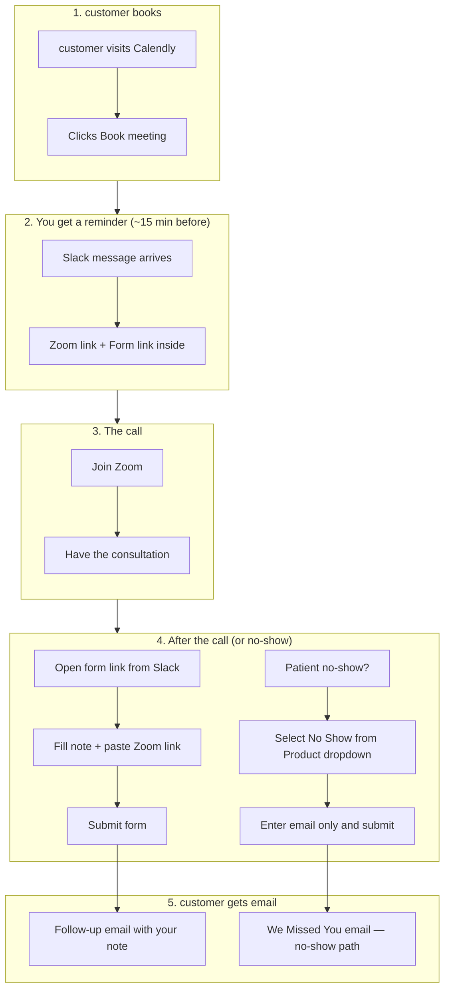
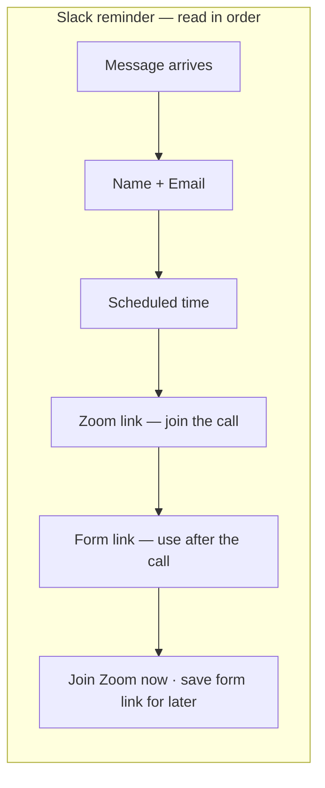
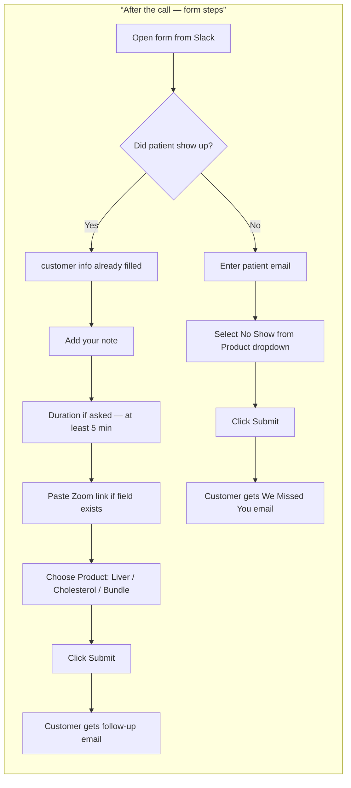
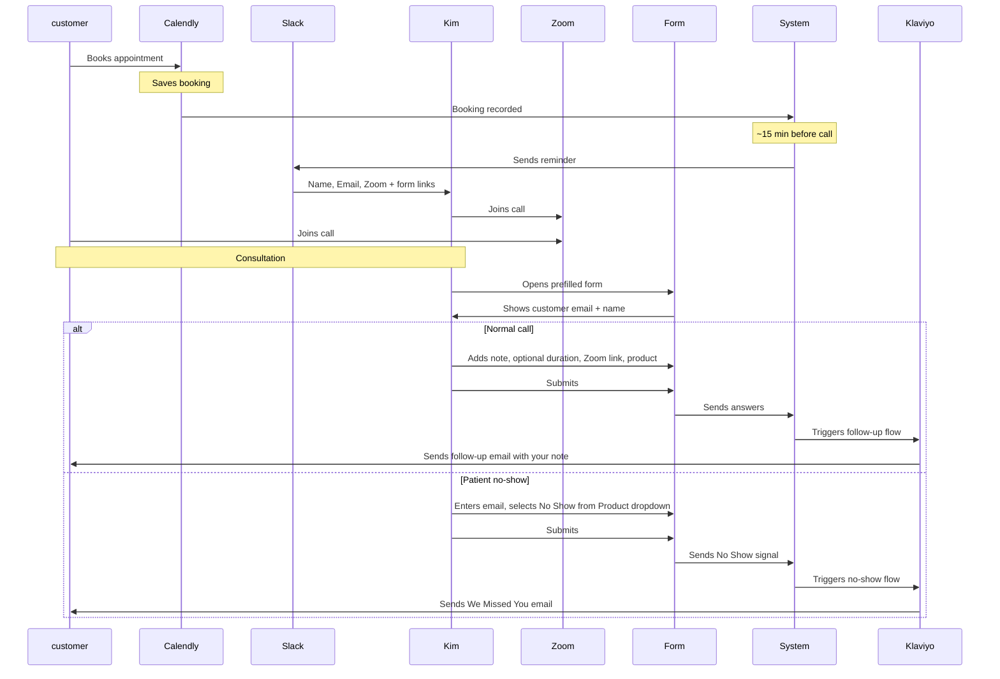

# Telehealth Workflow — Instruction Manual for the Nutritionist

A simple guide to your telehealth flow, from booking to follow-up email. No tech words — written so anyone can follow.

**Last updated:** 2026-04-03 (matches current automation in `CHANGELOG.md`.)

---

## The big picture: what happens when?

---

## Step-by-step: what you do

### 1. When a customer books

**What happens:**  
The customer fills out their name and email on your Calendly page and clicks **Book meeting**.

**What you do:**  
Nothing right now. The system records the booking.

---

### 2. About 15 minutes before the call

**What happens:**  
You get a **Slack** message that includes:

- **Name** — invitee’s name  
- **Email** — invitee’s email (shown on its own line, not mixed up with name)  
- **Scheduled** time  
- **Join Zoom meeting** (link)  
- **Open prefilled Telehealth Note form** (link)

**What you do:**  
Read the message, join Zoom from the link, and save the form link for after the call.

---

### 3. During the call

**What happens:**  
You and the customer are on Zoom.

**What you do:**  
Run the consultation as usual. You can use lists or bullets in your notes when you fill the form later.

---

### 4. Right after the call

**What happens:**
You complete the **Telehealth Note** form and submit it. That submission drives the follow-up email with **your** wording (including bullet-style lines when the email template is set up correctly).

**What you do — normal call:**

1. Open the **form link** from the Slack reminder.
2. Check that the form already has the right **email** and **name**.
3. Fill in:
   - **Kim’s note** — your summary for the customer
   - **Call duration (minutes)** — only if your form asks for it. Use the real length; it should be **at least 5 minutes**. If the form has no duration field, the system uses a default.
   - **Meeting UUID / Zoom** — paste the Zoom join link from Slack (helps match this visit to the booking).
   - **Product / program** — choose Liver, Cholesterol, or Bundle so the right follow-up email is sent.
4. Click **Submit**.

---

**What you do — patient didn’t show up:**

1. Open the form link from the Slack reminder.
2. Enter the patient’s **email**.
3. In the **Product / program** dropdown, select **No Show**.
4. Click **Submit** — that’s it. Notes and duration are not required.

The patient will automatically receive a **”We Missed You”** email. You do not need to do anything else.

---

### 5. customer follow-up email

**What happens:**  
After you submit the form, the system sends (or schedules) a follow-up email that includes your note. Lists and line breaks can show as neat lines in the email when the team uses the correct template in Klaviyo.

**What you do:**  
Nothing else—submission is the handoff.

---

## Visual: the complete flow

---

## Quick tips

| Do this | Avoid this |
|--------|------------|
| Use the form link from the **Slack reminder for that customer** | Using an old or generic form link |
| Paste the Zoom link into the meeting / UUID field when you have it | Skipping it if you were given a link—it helps matching |
| Submit soon after the call | Waiting many hours unless you have to |
| Check email and name before submit | Changing customer info unless it’s actually wrong |
| If the form asks duration, use **≥ 5 minutes** for a real consult | Entering under 5 for a full visit (normal follow-up won’t run) |
| For no-shows: select **No Show** from the Product dropdown and enter their email | Leaving the form blank or not submitting anything for a no-show |

---

## If something doesn’t work

### I don’t see a Slack message before the call

- Look about **15 minutes before** the scheduled time.  
- The Calendly event should use **Zoom** as the location when possible.  
- Ask your admin to confirm the reminder job and Slack are turned on.

### The form doesn’t have the customer’s email and name

- Use the link from the **Slack message for that booking**.  
- If it’s still wrong, correct the fields and submit.

### The customer didn’t get the follow-up email

- Confirm you **submitted** the form.
- If the form asks for **duration**, use **at least 5 minutes** for a completed consult.
- The customer’s **email** must be correct on the form.
- Ask your admin to check **Klaviyo** (skipped messages, filters, and email template — bad template syntax can block sends).

### I submitted a No Show but the customer didn’t get the "We Missed You" email

- Confirm you selected exactly **No Show** (capital N, capital S) from the Product/Program dropdown.
- Confirm the customer’s **email** was filled in correctly before submitting.
- Ask your admin to check Klaviyo — they can look up the event by email and confirm it was received.

### I don’t have the Zoom link

- Use the link from the **Slack** reminder.  
- Or copy it from the Zoom window (**Invite** or meeting info).

---

## Summary: your main actions

1. **Before the call:** Check Slack; use the Zoom link.
2. **During the call:** Run the consultation.
3. **After the call — patient attended:** Open the form link, add your note (and duration / Zoom / product if the form asks), and submit.
4. **After the call — patient no-show:** Open the form link, enter their email, select **No Show** from the Product dropdown, and submit.

The rest is automatic.

---

## For your tech team (optional pointer)

- Slack for telehealth reminders uses secret **`SLACK_WEBHOOK_URL_TELEHEALTH`** (separate from ETL Slack).  
- Form submissions send **`email`** and **`name`** on the event (not `customer_*` duplicates).  
- Klaviyo HTML emails should use **`{{ event.kims_custom_note|linebreaksbr }}`** — not `nl2br` — to avoid template errors.  
- Details: `docs/SLACK_WEBHOOK_SEPARATION.md`, `docs/KLAVIYO_POST_CALL_EMAIL_SETUP.md`, `CHANGELOG.md`.
