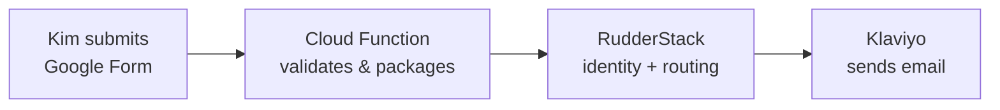
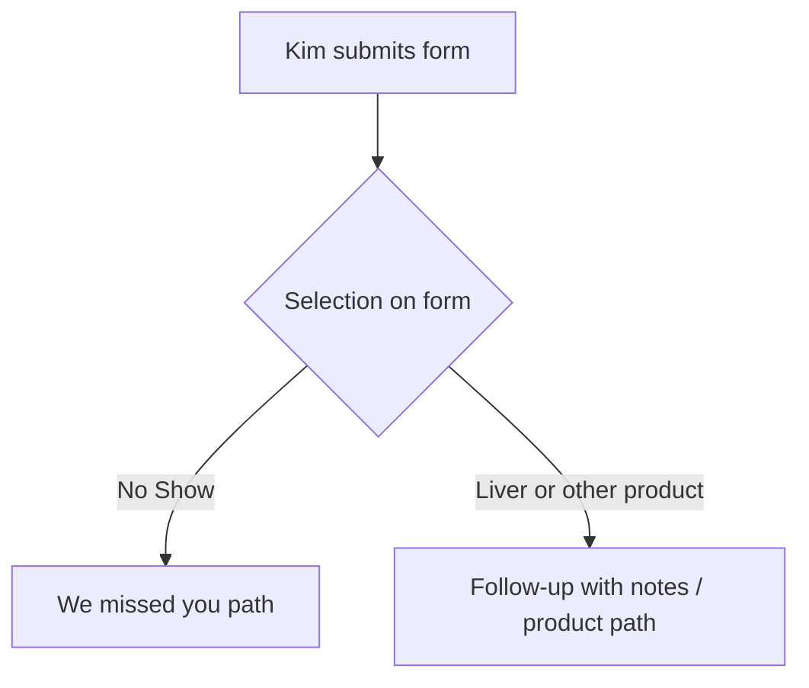

# How the Google Form drives the follow-up email

This page explains—in simple terms—what starts the patient follow-up email, what Zoom does (and does not) control, and how optional fields like meeting ID fit in.

---

## End-to-end flow

**Takeaway:** The **Google Form** (with the connected script) is what allows the follow-up email chain to run. Zoom does not replace that step.

---

## Step-by-step

| Step | What happens |
|------|----------------|
| 1 | Kim completes the Google Form (email, notes, product such as Liver, or No Show). |
| 2 | The form sends data to your Cloud Function, which checks configuration and normalizes identifiers. |
| 3 | RudderStack receives an **identify** (so the person is one known profile) and a **track** event Klaviyo listens for. |
| 4 | Klaviyo sends the appropriate message (e.g. program follow-up vs. “we missed you”). |

---

## Zoom vs. the form

| Question | Answer |
|----------|--------|
| Does the form prove the patient opened Zoom? | **No.** The form does not verify attendance on Zoom. |
| Who decides “they showed up” vs. no-show? | **Kim**—via the form (including the **No Show** path when that matches reality). |
| If Kim says a normal visit + a product (e.g. Liver), what does the system do? | It follows **Kim’s form** for routing and content, unless you add different business rules later. |

---

## Phone calls (no Zoom)

If the consult happens by phone instead of Zoom, the same pipeline applies: Kim still submits the form. Ensure Klaviyo flows do not assume Zoom-only data fields.

---

## Meeting ID / Zoom link on the form

| Piece | Role |
|-------|------|
| **Automatic Zoom data** | When a Zoom meeting ends, context (e.g. time, host, sometimes product) can be stored for later use. |
| **Optional field on the form** | Kim may paste a meeting ID or link to **link** that submission to a specific visit. |
| **If the field is blank** | The form still processes; you simply do not merge extra Zoom context onto that submission. |

**Summary:** Firestore + meeting ID are **optional linkage** between “Zoom ended” and “Kim submitted the form.” They do **not** replace the form as the trigger for Klaviyo.

---

## No Show vs. product (e.g. Liver)

| Kim selects | Typical email story |
|-------------|---------------------|
| **No Show** | “We missed you” (not attended). |
| **Liver** (or other product) | Follow-up with notes (attended). |

Kim should pick the option that matches what actually happened so patients get the right message.

---

## Duplicate profiles in Klaviyo

Different tools sometimes send the **same email** with **different user IDs** (e.g. Calendly ID vs. email as ID). Klaviyo can show two profiles for one person.

**Mitigation:** In RudderStack’s Klaviyo destination, enable **use email or phone as primary identifier**, then **merge** historical duplicates once in Klaviyo.

---

## Google Voice instead of Zoom

| | Impact |
|--|--------|
| **Unchanged** | Form → Cloud Function → RudderStack → Klaviyo can work the same if Kim keeps using the form. |
| **Reduced** | You lose automatic **Zoom-only** context (unless you rebuild it from another source). |
| **Planning** | See **[GOOGLE_VOICE_PLANS_AND_ZOOM_REPLACEMENT.md](GOOGLE_VOICE_PLANS_AND_ZOOM_REPLACEMENT.md)** for plans, BigQuery export, and identity rules. |

---

## Quick reference

| Question | Short answer |
|----------|----------------|
| What starts the follow-up email? | Kim’s **Google Form** (with script), not “opening Zoom.” |
| Is Zoom required for the email? | **No** for sending. **Yes** only if you rely on automatic Zoom enrichment. |
| Is meeting ID required? | **No.** It only adds data when it matches stored visit context. |
| Does the system know if they joined Zoom? | **Not from the form alone.** Use **No Show** when appropriate. |
| Two profiles for one email? | Often mismatched IDs across sources; fix RudderStack + merge in Klaviyo. |

---

## Roles (no code)

| Role | Responsibility |
|------|----------------|
| **Kim** | Submits the form; selections determine routing. |
| **Google Form + script** | Delivers submission to the backend. |
| **Cloud Function** | Validates secrets, normalizes email, builds the RudderStack payload. |
| **RudderStack** | Identity and event routing to warehouse and Klaviyo. |
| **Klaviyo** | Delivers the patient-facing emails. |

---

*This reflects how the pipeline is designed today. If rules change (for example, “never send product follow-up unless Zoom confirms join”), that would be a separate product and engineering change.*
