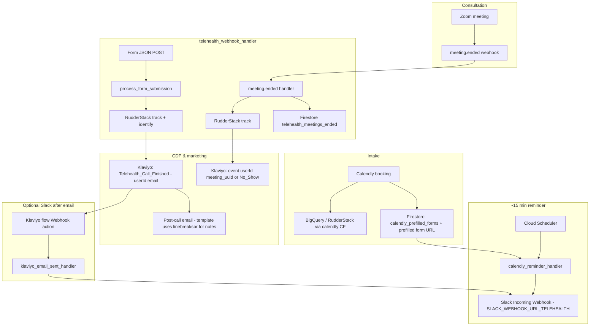

# Telehealth Automation Workflow — Technical Plan of Attack

**Objective:** Lean, HIPAA-conscious automation using Calendly, Zoom, Google Cloud Functions, RudderStack, BigQuery, and Klaviyo — no CRM in the critical path.

**Alignment:** This document matches **`main.py`** (`telehealth_webhook_handler`), sibling Cloud Functions (`functions/calendly`, `functions/calendly_reminder`, `functions/klaviyo_email_sent`), and **`CHANGELOG.md`** as of **2026-03-30**.

---

## 1. Current trigger strategy (production)

| Path | Trigger | Behavior |
|------|---------|----------|
| **Primary — post-call note + Klaviyo email** | **Google Form** → Apps Script POST → **`telehealth_webhook_handler`** | Validates JSON (`email` or `customer_email` + `kims_custom_note` / `kims_note`). Optional `FORM_SUBMIT_SECRET` (`X-Form-Secret`). Duration defaults to **10** minutes if omitted; if provided, **&lt; 5 minutes** → **200** with no RudderStack send (no-show guard). **`identify`** then **`track`**: `Telehealth_Call_Finished`, **`userId` = customer email**. Event properties: **`email`**, **`name`** (canonical — no duplicate `customer_*` on the event), **`kims_custom_note`** as newline-separated **`•`** bullet lines (parses `1. … 2. …`), **`duration`**, **`source`: `google_form`**, attended flags, optional **`productName`** / **`Product`** (canonical Liver / Cholesterol / Bundle), optional **`meeting_uuid`**, merged **`host_email`** / **`meeting_date`** from Firestore when meeting matches. Profile traits via identify: **`completed_telehealth_call`**, **`telehealth_call_attended`**, **`telehealth_attended`**, **`productName`**, **`telehealth_last_product`**. |
| **Zoom — meeting lifecycle + Firestore** | Zoom **`meeting.ended`** → same HTTP function | **Signature** verification runs but is currently **non-blocking** (see `main.py` — tighten before hard production). **Idempotency:** if `meeting_uuid` already exists in Firestore (`telehealth_meetings_ended`), return **Already processed** (avoids duplicate Klaviyo rows from Zoom retries). Duration: Zoom sends **seconds** → stored and checked in **minutes**; optional recomputation from **`start_time`** if Zoom sends near-zero duration. **&lt; 10 minutes** → **`Telehealth_Call_No_Show`** to RudderStack; **≥ 10 minutes** → **`Telehealth_Call_Finished`** with **`kims_custom_note`: `"No custom notes provided."`**, **`userId` = `meeting_uuid`**, optional **`productName`** from meeting **topic** (liver / cholesterol / bundle). **Firestore** stores meeting for form lookup (**`meeting_id`**, **`product_name`**, etc.). |
| **Transcript / Gemini pipeline** | Code: **`process_transcript_and_send_to_rudderstack()`** in `main.py` | **Not invoked** by the current HTTP handler (form + `meeting.ended` only). Poll / **`recording.transcript_completed`** paths described in older docs were removed or disconnected per **CHANGELOG (2026-03-09)**. For **rich notes in Klaviyo**, the **Google Form** path is authoritative today. Optional future: re-wire transcript webhook or Tasks poll — see `docs/ZOOM_FAST_PATH_SETUP.md` for historical fast-path design. |

### 1.1 Webhook URL

- Single Gen2 HTTP function: **`telehealth_webhook_handler`** (deploy from repo root `main.py` via `scripts/deploy_zoom_webhook.sh`).
- Must handle Zoom **`endpoint.url_validation`** (HMAC with `ZOOM_SECRET_TOKEN`).
- **Public invoke** (or org-approved equivalent) required for Zoom and form POSTs when using `--no-allow-unauthenticated` deploy + Cloud Run “Allow public access.”

### 1.2 Data flow (Mermaid — current)

### 1.3 Safety checks (summary)

| Check | Where | Rule |
|-------|--------|------|
| Form duration | `process_form_submission` | **&lt; 5 min** → no `Telehealth_Call_Finished` send (**200**). Missing duration → **DEFAULT_FORM_DURATION_MINUTES** (10). |
| Zoom short meeting | `meeting.ended` | **&lt; 10 min** → **`Telehealth_Call_No_Show`**; else completed-style event with placeholder note. |
| Transcript word count | `process_transcript_and_send_to_rudderstack` | **&lt; 50 words** → treat as no-show if that path is used again. |
| Duplicate Zoom event | `meeting.ended` | Firestore hit on `meeting_uuid` → skip second RudderStack send. |

### 1.4 Identity resolution

- **Form path:** **`userId` = customer email** — preferred for Klaviyo **Send Email** and merge tags **`event.email`** / **`event.name`**.
- **Zoom-only `meeting.ended` path:** **`userId` = `meeting_uuid`** — Klaviyo often cannot send a person email without extra identity work; use form path or warehouse join for customer-level messaging.
- **Calendly → BigQuery** remains the source for historical booking rows; Firestore **`calendly_prefilled_forms`** supports operational reminders and prefilled links.

### 1.5 Slack secrets (telehealth vs ETL)

- **Telehealth-only** Slack URL: GSM **`SLACK_WEBHOOK_URL_TELEHEALTH`** → mapped to runtime **`SLACK_WEBHOOK_URL`** on **`calendly_reminder_handler`** and **`klaviyo_email_sent_handler`**.
- **ETL / other bots:** GSM **`SLACK_WEBHOOK_URL`** — do not overwrite with telehealth URL.  
- See **`docs/SLACK_WEBHOOK_SEPARATION.md`**.

### 1.6 HIPAA-lean notes

- Secrets in **Google Secret Manager**; IAM least privilege.  
- HTTPS in transit.  
- Avoid logging full PHI in plaintext; structured logs for outcomes.  
- BAAs with vendors that touch PHI (Zoom, GCP, RudderStack, Klaviyo, LLM if enabled).

---

## 2. Transcript extraction (when re-enabled)

Regex-first extraction for **`Summary for the email:`** / **`Notes for the email:`** — pattern in `main.py` as **`SUMMARY_FOR_EMAIL_PATTERN`**. Optional Gemini (`google-genai`) for sentiment / summary / fallback note. Default empty note string when not found.

---

## 3. Google Form as the primary note bridge

The form is not a legacy fallback — it is the **main** way **`kims_custom_note`** reaches Klaviyo with **`userId` = email**. Apps Script: **`scripts/google_form_to_rudderstack.js`** posts to the **same URL** as the Zoom webhook, with optional **`X-Form-Secret`**.

---

## 4. Klaviyo

- **Trigger metric:** **`Telehealth_Call_Finished`** (form-driven for reliable email).  
- **Filter:** e.g. **`duration` ≥ 5**; do not restrict **`source`** to `zoom_meeting_ended` if you use the form (`google_form`).  
- **Email body:** use **`{{ event.kims_custom_note|linebreaksbr }}`** (or **`newline_to_br`**). **`nl2br` is invalid** in Klaviyo → **Email Syntax Error**.  
- **Splits:** event **`productName`** or profile trait **`productName`** (identify) depending on split type — see **`docs/KLAVIYO_POST_CALL_EMAIL_SETUP.md`**.  
- **Webhook → Slack after Send Email:** **`klaviyo_email_sent_handler`**; URL from deploy; body at least **`{{ person.email }}`**; optional **`name`** from **`{{ event.name }}`**.

---

## 5. Verification vs this plan

| Topic | Current codebase |
|-------|------------------|
| Primary Klaviyo note path | Google Form → `telehealth_webhook_handler` → RudderStack |
| Zoom `meeting.ended` | Immediate RudderStack + Firestore; no transcript wait in handler |
| `recording.transcript_completed` / poll in handler | Not active in `telehealth_webhook_handler` per CHANGELOG |
| Event properties (form) | `email`, `name`, bullet `kims_custom_note`, `productName`, attended fields |
| No-show signals | Form duration &lt; 5; Zoom duration &lt; 10 min → **`Telehealth_Call_No_Show`** |
| Calendly reminder Slack | Separate **Name** and **Email** fields in attachment |
| Telehealth Slack URL | **`SLACK_WEBHOOK_URL_TELEHEALTH`** on reminder + Klaviyo callback functions |

---

## 6. Related docs

- **`CHANGELOG.md`** — authoritative decision history.  
- **`docs/KLAVIYO_POST_CALL_EMAIL_SETUP.md`** — flows, filters, webhook, **linebreaksbr**.  
- **`docs/SLACK_WEBHOOK_SEPARATION.md`** — two Slack secrets.  
- **`docs/ZOOM_FAST_PATH_SETUP.md`** — optional / historical fast path.  
- **`docs/PERMISSION_REQUEST_EMAIL.md`** — stakeholder email draft.
